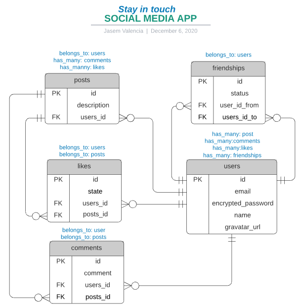
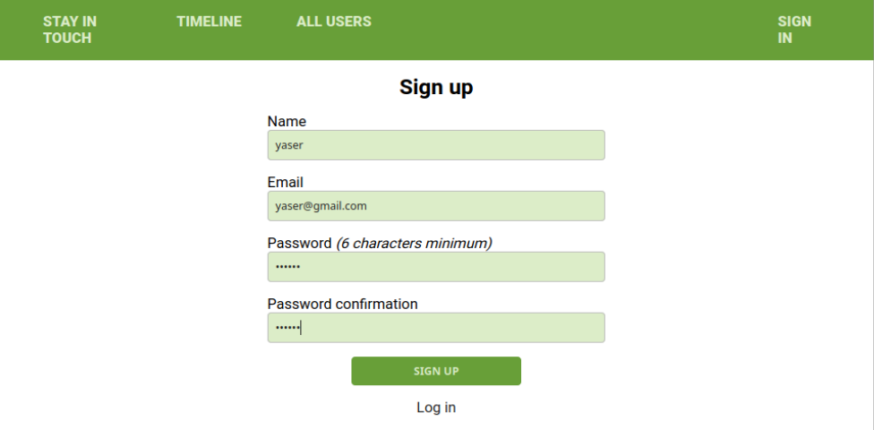
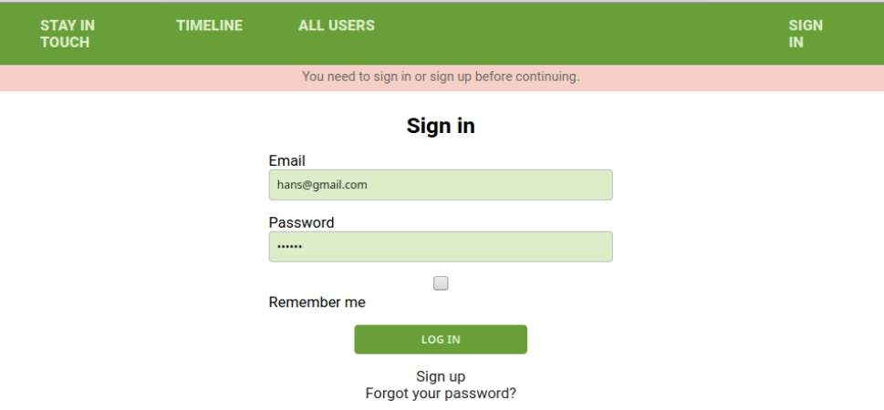
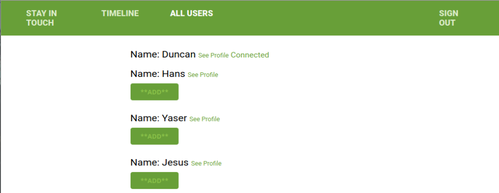
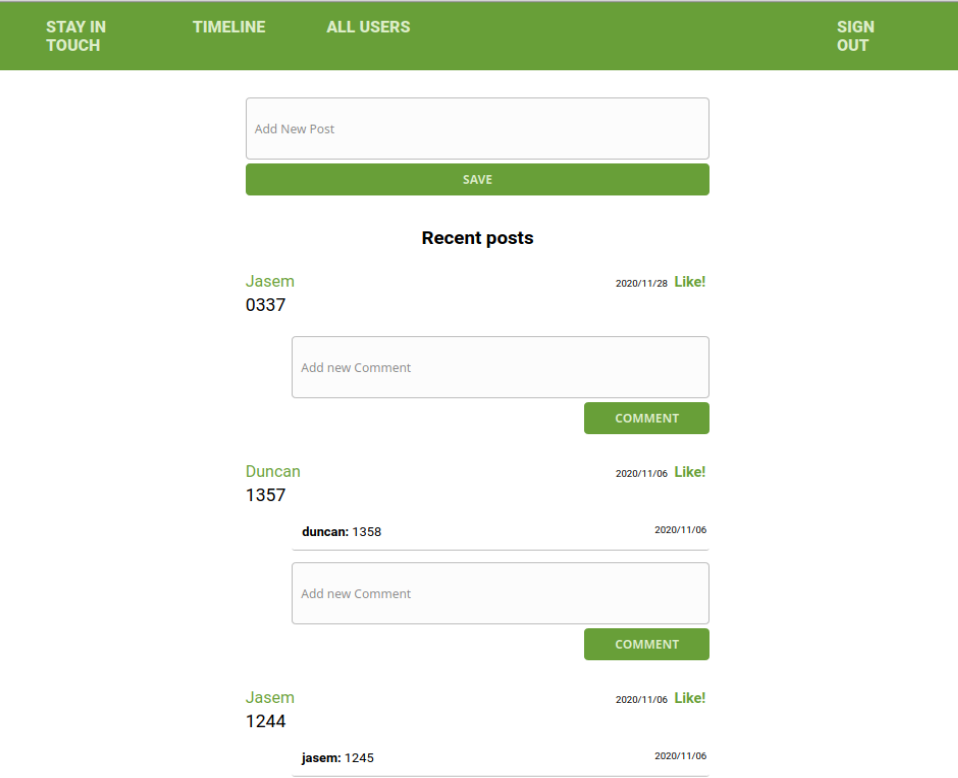
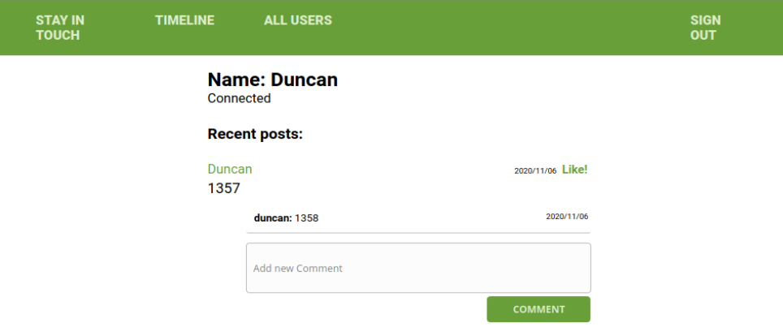
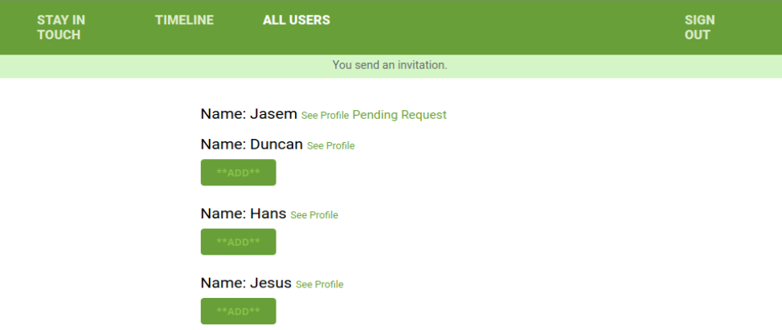
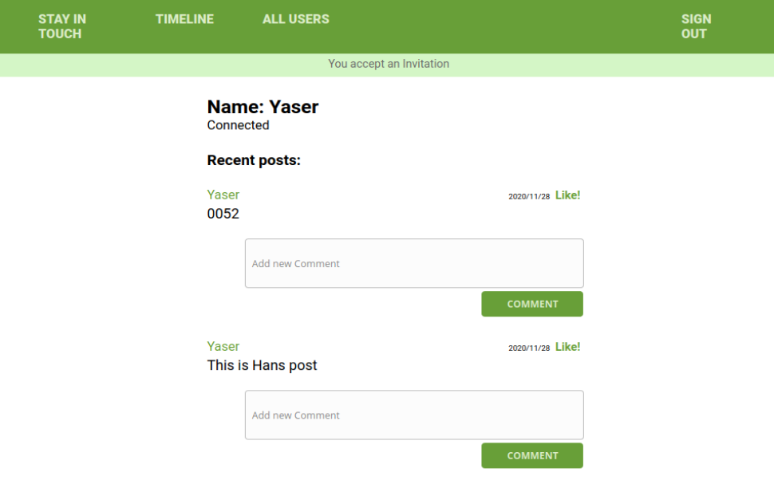

# Scaffold for social media app with Ruby on Rails 🚀

> This repo includes intial code for social media app with basic styling. Its purpose is to be a starting point for Microverse students. 
> This project recreate a social network 🌆. You can create a profile 👨, have a wall for post 📃, send request for new friends 📧 and give like to post 👍.

### Entity Relationship Diagram 📊



### Create account 💻



### Login ✋




### See all the users 👓 




### See the post and comment timeline ✏️




### Each user has a profile 📃




### Send a new friend request 📧




### Accept a request and start a relationship 👬




## Live Demo 🎥

-   [Link to Heroku](https://hidden-savannah-28034.herokuapp.com/)

## Built With 💪

-   ruby '2.7.1'
-   'rails', '~> 6.0.3', '>= 6.0.3.2'


## Getting Started 🚶

​To have a version on your local machine:

-   Clone this repository
-   Open a terminal on the containing folder of this project
-   Run 'bundle install' to install the dependencies
-   Set the database using the command 'bin/rake db:migrate'
-   Run the server using the command 'rails server'
-   Access http://localhost:3000/ in your browser
-   Use the links, forms and buttons to explore the features and create objects in our database

## Run Tests ✔️

```
    rpsec 
```
## Authors

👤 **Jasem Duncan Valencia Vargas**

-   Github: [@JasemDuncan](https://github.com/JasemDuncan)
-   Linkedin: [@Jasem-Duncan-Valencia](https://www.linkedin.com/in/jasem-duncan-valencia/)

👤 **Kingsley McSimon Ogbonna**

-   Github: [@KingsleyMcSimon](https://github.com/KingsleyMcSimon)
-   Linkedin: [@KingsleyMcSimon](https://www.linkedin.com/in/kingsley-mcsimon-o-44411517a/)


## 🤝 Link To The Project On Github: 

[Project On Github](https://github.com/KingsleyMcSimon/Private-Events)

## 🤝 Contributing

Contributions, issues and feature requests are welcome!

Feel free to check the [issues page](issues/).

## Show your support

Give a ⭐️ if you like this project!

## 📝 License

This project is [MIT](lic.url) licensed.

